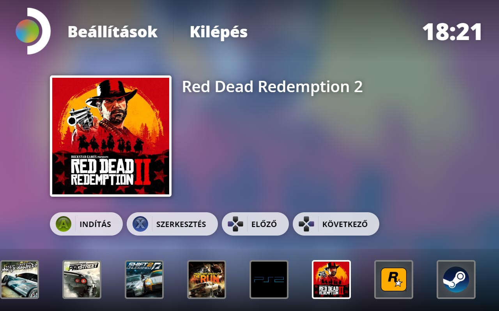

# Windeck

Indítópult alkalmazás a Windows rendszert futtató Steam Deck eszközökre.

## Telepítési útmutató

1. **Modulok telepítése**:
```bash
npm install
```

## Használati útmutató

####Development

**Futtatás a helyi hálózaton böngészőben teszteléshez**:
```bash
npm run dev
```

**Tauri funkciók tesztelése**

**Futtatás a helyi hálózaton natív alkalmazás teszteléséhez**:
```bash
npm run tauri dev
```

####Release

```bash
npm run tauri build
```

A folyamat befejeztével a target/release/bundle/msi könyvtárban található a telepítő.

## Rendszerkövetelmények

- **Platform**: Windows
- **Szükséges támogatás**: WebView2

Fejlesztéshez: [https://v1.tauri.app/v1/guides/getting-started/prerequisites/](https://v1.tauri.app/v1/guides/getting-started/prerequisites/)

## Tech Stack
- Vite.js
- Typescript
- Tauri.js

## Képernyőképek
<div style="display: flex; justify-content: space-between;">

</div>